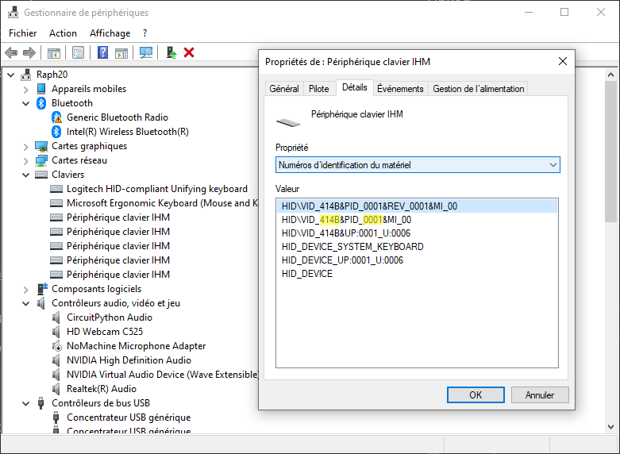

# KBLayerHelper

On Screen Display keyboard layer name and layout image for QMK - Autohotkey based

## Overview

This Autohotkey script listen to QMK HID debug messages sent on layer changes and notifies the user by displaying the layer name, a layout image and the layer index on the tray icon.


## Requirements

This script requires Autohotkey v1.1+ and AHKHID library.
The QMK keymap must be modified to send debug messages (see below).

## Setup

Download and install [Autohotkey v1.1+](http://www.ahkscript.org/).
Download [AHKHID](https://github.com/jleb/AHKHID) and copy `AHKHID.ahk` in _autohotkey/lib_ folder.
Clone this repo.

In QMK, enable console mode (`CONSOLE_ENABLE = yes` in your `rules.mk`) and in your `keymap.c`, include print.h and add the following function :

```
#include "print.h"


...

// Call on every layer change.
// Send LayerN (N is layer index)
// Used by Autohotkey to display current layer info.
layer_state_t layer_state_set_user(layer_state_t state) {
  uprintf("Layer%u", get_highest_layer(state));
  return state;
}
```

Edit `KBLayerHelper.ini` to fill your keyboard VendorID and ProductID. You can retrieve it using Windows Hardware :


### KBLayerHelper.ini

```
[Device]
VendorId = 0x414B
ProductId=0x0001

[General]
; Layout and layer name remain on screen if DisplayLock is on
; Duration has no effect
DisplayLock =0
; Hotkey to enable/disable DisplayLock
LockHotKey =+^!#F12

; Display layout image, as configured in [Layers] section
[Layout]
DisplayLayout =1
; Timeout before hiding layout (ms)
Duration = 3000
; Position on screen (x, y)
; integer or 'center'
; If >= 0 : from left/top,
; if < 0 : from right/bottom
Position = center, -50
; Size (width, height)
; Image is resized to fit in defined size respecting aspect ratio
Size = 600, 200
; Font size of the layer name added on the image
FontSize = 18


; Display the layer name alone
[LayerName]
DisplayLayerName =1
Position = -50, -50
; The size of the label is fixed, set it according to your
; longest layer name and the font size
Size = 200, 30
Duration = 3000
FontSize = 20


; Define the layers :
;   - Name to use on the layout image and the label
;   - Icon used on the tray
;   - Layout image to display
[Layers]
; Layer Name, icon file, help image
; default values :
; "Layer N", "./icons/ico/Number-N.ico", "./png/Layer-N.png"
Layer0 = Base, ,./png/0Base_Layer.png
Layer1 = Azerty, ,./png/1Azerty_Layer.png
Layer2 = Symbol, ,./png/2Symbol_Layer.png
Layer3 = Num,,./png/3Numpad_Layer.png
Layer4 = Nav, ,./png/4Nav_Layer.png
```
